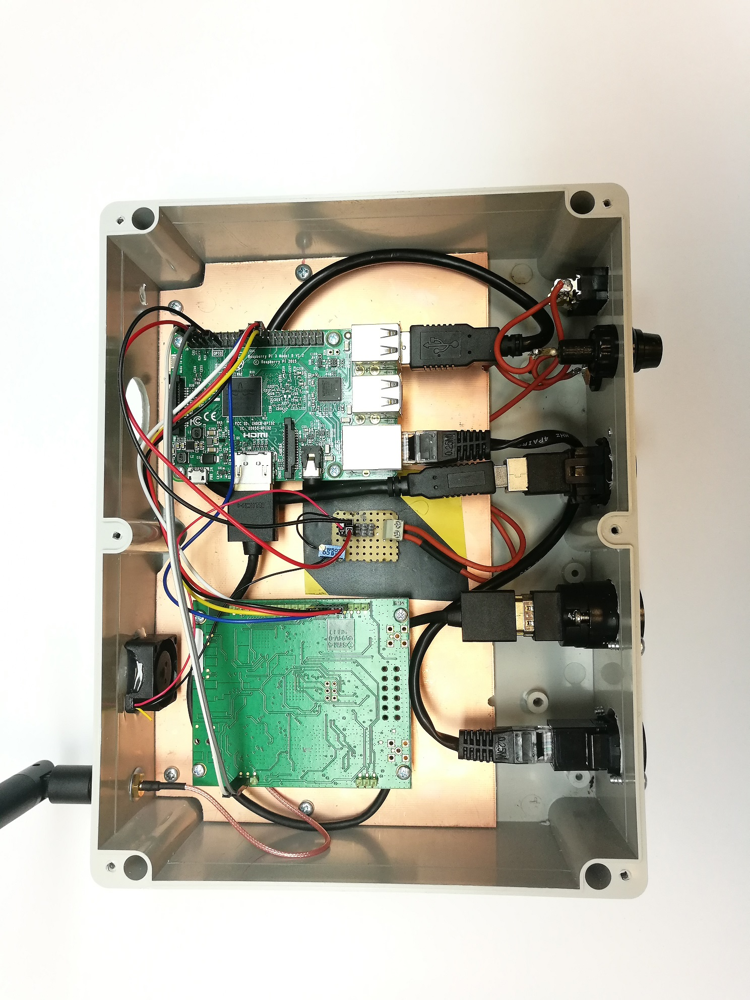
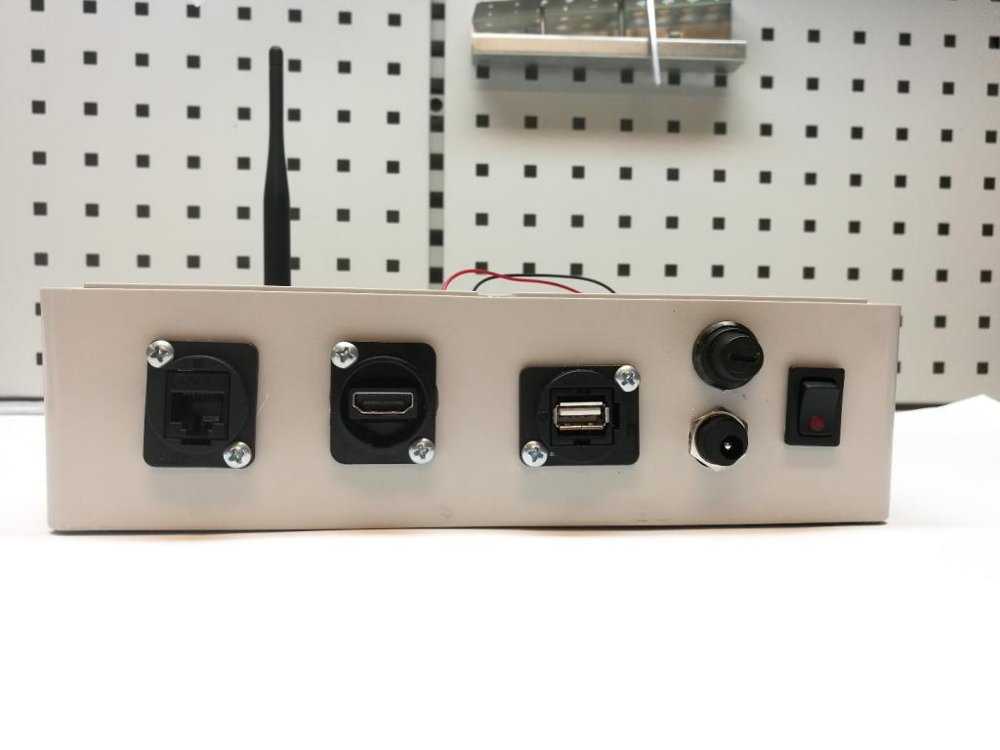

# DIY SKaNeR TTN Gateway<Name>
## Gateway description
Based on instructions: https://www.thethingsnetwork.org/docs/gateways/start/build.html
Partlist:
  * IC880-CA
  * RASPBERRY PI 3B
  * Supply 5V 3A
  * Fan
  * Others
## FOTO

## Gateway diagram

