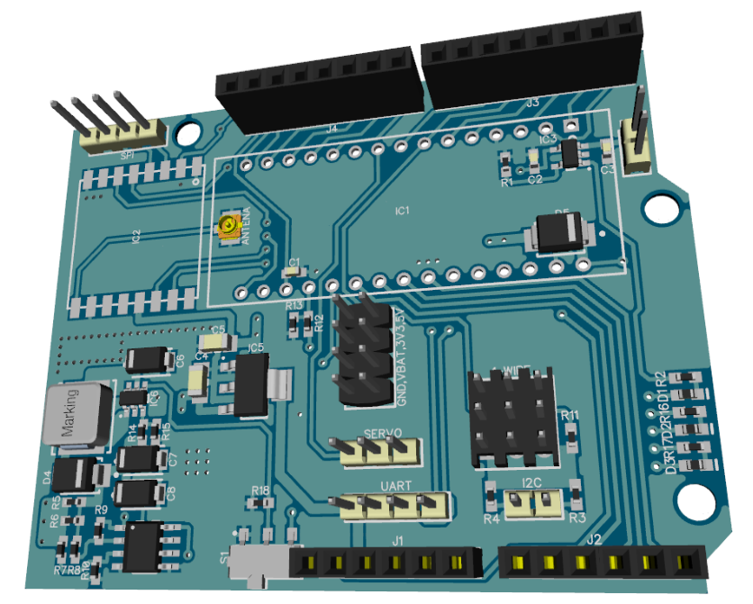
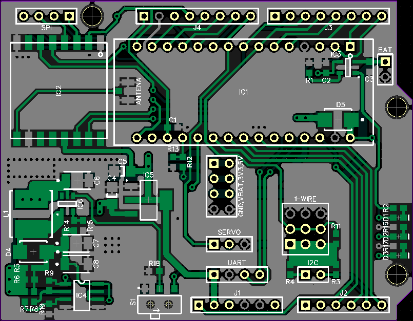
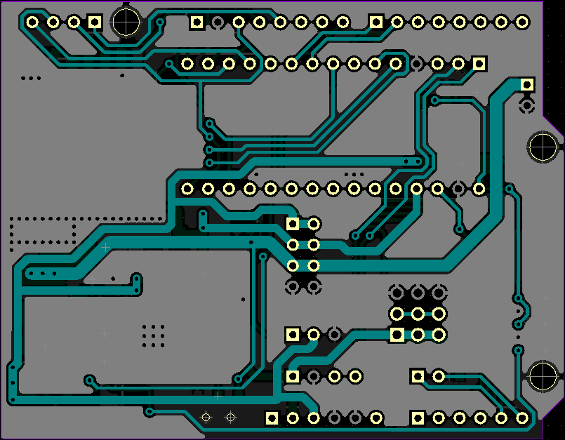

# pcb <Name>
## ttn-tul-node-v1 pcb
ttn-tul-node-v1 to pierwsza płytka zaprojektowana przez zespół IOT-TUL. Głównym celem modułu jest zapewnienie komunikacji mikroprocesora z resztą infrastruktury LoRa. Płytka jest kompatybila ze wszystkimi modułami o pinach zgodnych z Arduino Uno lub Arduino Nano. ttn-tul-node-v1 posiada wyprowadzenia pozwalające na szybkie podłczenie modułów używających najpopularniejszych interfejsów, takich jak: i2c, spi, uart, 1-wire.

Autor schematu oraz pcb: Rafał Dolny

### 3D RENDER

### PCB TOP

### PCB BOTTOM 

