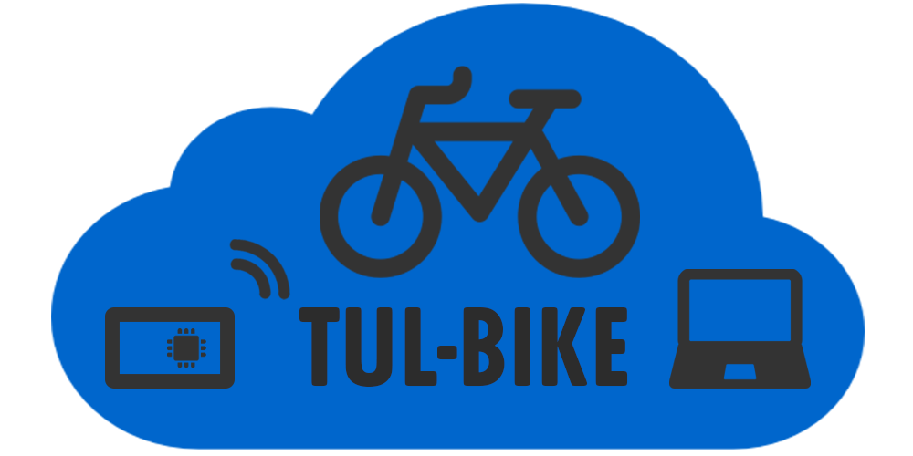

# TUL-BIKE

# About project

**Projekt TUL-BIKE** wykorzystuje rozwiązania LoRaWAN do zbierania danych z GPS przymocowanego do roweru. Pozwala to na badanie położenia i efektywne odszukiwanie zagubionych obiektów. Zastosowanie technologii LoRa pozwala zminimalizować zużycie energii oraz zapewnić komunikację w miejscach gdzie nie ma dostepu do WiFi. Pierwsza iteracja projektu skupia się głównie na lokalizacji rowerów, lecz uzyskana w ten sposób wiedza będzie wstępem do szerszego zastosowania technologi LoRa do zbierania danych z czujników w przemyśle, smart-city, rolnictwie i rozrywce.

# Authors

## Mentors

* Prof. dr hab. inż. Adam Pelikant
* Dr hab. inż. Grzegorz Granosik, prof. PŁ

## Team

* Stanisław Puławski
* Natalia Walczak
* Piotr Ładoński
* Maciej Bednarek

