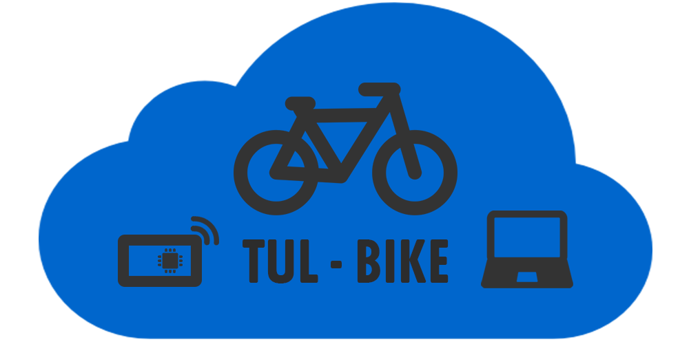

# TUL-BIKE

## About project

**Projekt TUL-BIKE** wykorzystuje technologię komunikacji LoRa (Long Range) do przekazywania danych z GPS przymocowanego do roweru. Pozwala to na badanie położenia i efektywne odszukiwanie zagubionych obiektów. Zastosowanie LoRa pozwala zminimalizować zużycie energii oraz zapewnić bezprzewodową komunikację bez użycia WiFi oraz GSM. Realizacja projektu TUL-BIKE będzie wstępem do szerszego zastosowania technologi LoRa do zbierania danych z czujników w przemyśle, smart-city, rolnictwie i rozrywce.

**Projekt realizowany w ramach [Konkursu Rektora Politechniki Łódzkiej „Smart Campus - krok w kierunku inteligentnego kampusu”](https://www.p.lodz.pl/pl/znamy-zwycieskie-projekty-konkursie-smart-campus-na-pl)**

## Authors

### Mentors

* Prof. dr hab. inż. Adam Pelikant
* Dr hab. inż. Grzegorz Granosik, prof. PŁ

### Team

* Stanisław Puławski
* Natalia Walczak
* Piotr Ładoński
* Maciej Bednarek
